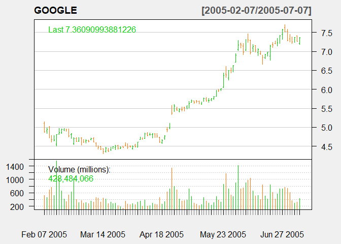

Financial Time series Analysis and Forecasting using R
================
Daniel James
2023-12-21

# Stock Forecasting with Google

### Outline

###### Time series is a sequential set of data points, measured typically over successive times. It is mathematically defined as a set of vectors {Yt,t∈Z} where t represents the time. The data used for all the below method (ARIMA) were historical daily prices of the Google. The goal of this study is to model and forecast financial time series using the stochastic process (ARIMA).

### Load Packages

#### Important librarys

##### The packages used in this study are listed below.

### Step 1 - Install necessary packages

``` r
library(pacman)


p_load(lubridate)                 # for dates manipulation 
p_load(fBasics)                   # to enhanced summary statistics
p_load(lmtest)                    # for coefficients significance tests
p_load(urca)                      # for unit rooit test
p_load(ggplot2)                   # for data visualization
p_load(quantmod)                  # for getting financial data
p_load(PerformanceAnalytics)      # to calculating returns
p_load(rugarch)                   # for GARCH modeling
p_load(FinTS)                     # for ARCH test
p_load(forecast)                  # for ARMA modeling
p_load(strucchange)               # for structural changes 
p_load(TSA)                       # for ARMA order identification 
p_load(tseries)                   # for others
p_load(timeSeries)                # for others
p_load(timeSeries)                # for others
p_load(xts)                       # for others
p_load(pastecs)                   # for others
p_load(readxl)                    # to load in data
p_load(zoo)                       # for others
```

### Step 2 Import Data from Yahoo! Finance

#### Getting Data

###### The [Google Stock dataset](https://online.stat.psu.edu/onlinecourses/sites/stat501/files/ch15/google_stock.txt) having a total number of 105 observations and 7 variables. The data downloaded from [Yahoo! Finance](https://finance.yahoo.com/?guccounter=1&guce_referrer=aHR0cHM6Ly9yc3R1ZGlvLXB1YnMtc3RhdGljLnMzLmFtYXpvbmF3cy5jb20v&guce_referrer_sig=AQAAAJH4MynrY4bQqPd-bmWidSVVMB6f_jCjAijLbw8QkktShpT9tDXal9DA6hemxvOm04KVLWBfAwdlWugkljL09B5LCOZSzKPBbO5KuJeN6fFUB9LqHhrIArqBn_0MT8wygguV8ZDJ2m4K7waoyOoSVuRjqOS2uyjLfJ9ttWOUo2Rk). The closing price was chosen to be modeled and predicted. Which are covered the period from February 7, 2005 to July 7, 2005. We will analyze the dataset to identify the order of an autoregressive model.

###### Taking advantage of the getSymbols() function made available within quantmod package we get Google stock.

### Step 2 - Import Data

``` r
GOOGLE = getSymbols('GOOG', from='2005-02-07', to='2005-07-08',auto.assign = FALSE)
```

``` r
GOOGLE = na.omit(GOOGLE)
head(GOOGLE)
           GOOG.Open GOOG.High GOOG.Low GOOG.Close GOOG.Volume GOOG.Adjusted
2005-02-07  5.112338  5.140731 4.869498   4.882449   520359150      4.882449
2005-02-08  4.905613  4.981827 4.845089   4.947456   460921194      4.947456
2005-02-09  5.000258  5.021179 4.718813   4.771615   689434520      4.771615
2005-02-10  4.781328  4.787306 4.613956   4.681951   762154073      4.681951
2005-02-11  4.649074  4.790046 4.634379   4.667505   526606480      4.667505
2005-02-14  4.554180  4.808975 4.508103   4.806733  1548269624      4.806733
```

#### Select

``` r
# Select the relevant close price series
stock_prices = GOOGLE[,4]
head(stock_prices)
           GOOG.Close
2005-02-07   4.882449
2005-02-08   4.947456
2005-02-09   4.771615
2005-02-10   4.681951
2005-02-11   4.667505
2005-02-14   4.806733
```

``` r
tail(stock_prices)
           GOOG.Close
2005-06-29   7.290673
2005-06-30   7.326289
2005-07-01   7.254060
2005-07-05   7.365144
2005-07-06   7.260785
2005-07-07   7.360910
```

### Import data from laptop

###### The Google Stock dataset downloded from: <https://online.stat.psu.edu>

``` r
google_stock <- read_excel("google_stock.xlsx")
# first 6 observations
head(google_stock)
# A tibble: 6 × 2
  date                price
  <dttm>              <dbl>
1 2005-02-07 00:00:00  196.
2 2005-02-08 00:00:00  199.
3 2005-02-09 00:00:00  192.
4 2005-02-10 00:00:00  188.
5 2005-02-11 00:00:00  187.
6 2005-02-14 00:00:00  193.
```

``` r
tail(google_stock)
# A tibble: 6 × 2
  date                price
  <dttm>              <dbl>
1 2005-06-29 00:00:00  293.
2 2005-06-30 00:00:00  294.
3 2005-07-01 00:00:00  291.
4 2005-07-05 00:00:00  296.
5 2005-07-06 00:00:00  292.
6 2005-07-07 00:00:00  296.
```

### Step 3 - Descriptive statistics

``` r
summary(google_stock)
      date                            price      
 Min.   :2005-02-07 00:00:00.00   Min.   :175.0  
 1st Qu.:2005-03-16 00:00:00.00   1st Qu.:187.4  
 Median :2005-04-22 00:00:00.00   Median :215.8  
 Mean   :2005-04-22 14:51:25.71   Mean   :224.7  
 3rd Qu.:2005-05-31 00:00:00.00   3rd Qu.:274.8  
 Max.   :2005-07-07 00:00:00.00   Max.   :304.1  
```

###### For more descriptive statistics, use stat.desc() from the package {pastecs}:

``` r
stat.desc(google_stock)
                     date        price
nbr.val      1.050000e+02 1.050000e+02
nbr.null     0.000000e+00 0.000000e+00
nbr.na       0.000000e+00 0.000000e+00
min          1.107734e+09 1.749900e+02
max          1.120694e+09 3.041000e+02
range        1.296000e+07 1.291100e+02
sum          1.169891e+11 2.359510e+04
median       1.114128e+09 2.158100e+02
mean         1.114181e+09 2.247152e+02
SE.mean      3.700247e+05 4.194028e+00
CI.mean.0.95 7.337729e+05 8.316916e+00
var          1.437642e+13 1.846937e+03
std.dev      3.791625e+06 4.297600e+01
coef.var     3.403059e-03 1.912465e-01
```

### Visualize the time series

###### More precisely, we have available OHLC (Open, High, Low, Close) index value, adjusted close value and trade volume. Here we can see the corresponding chart as produced by the chartSeries within the quantmod package.

``` r
chartSeries(GOOGLE, type = "bars", theme="white",main="Google Stock")
```

<!-- -->
