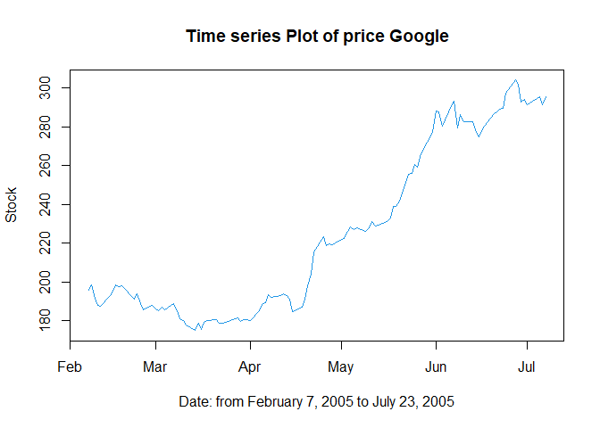
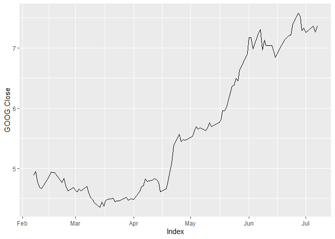
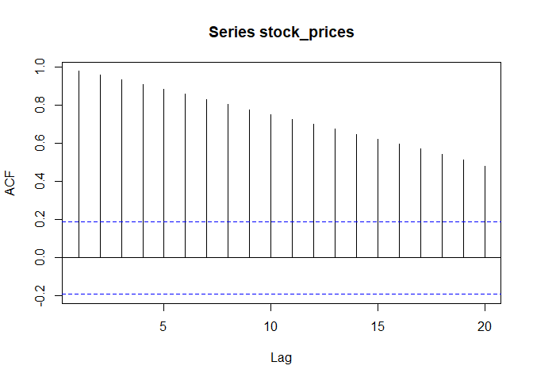
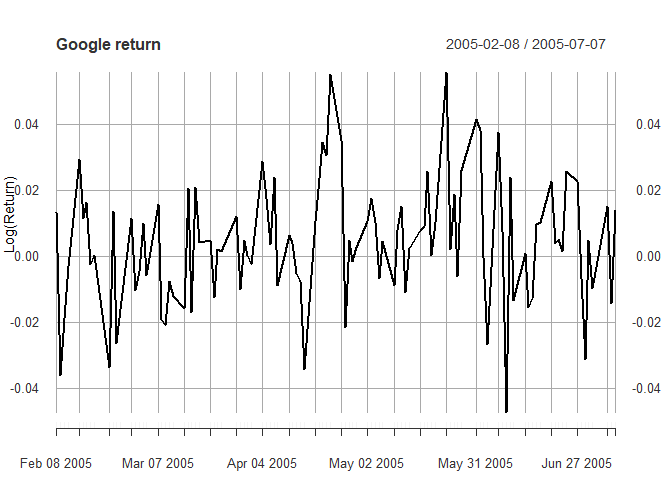
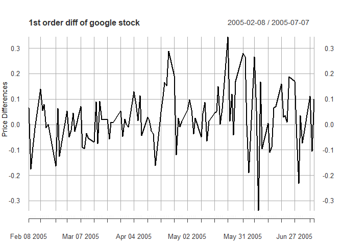
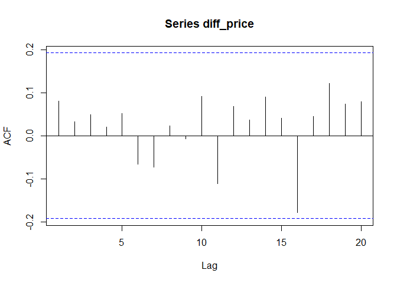
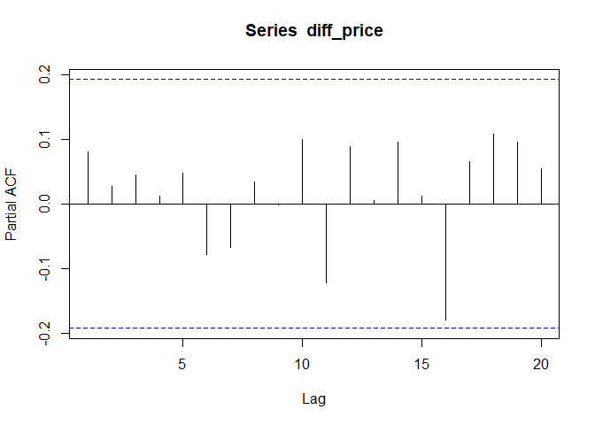
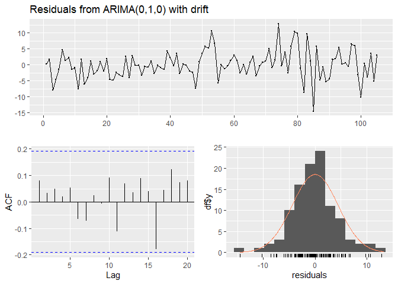
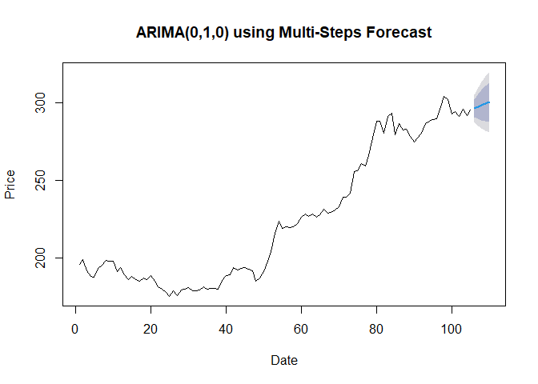

Financial Time series Analysis and Forecasting using R
================
Daniel James
2023-12-22

This work is frome [here](https://rpubs.com/HassanOUKHOUYA/time_series)

# Stock Forecasting with Google

### Outline

Time series is a sequential set of data points, measured typically over
successive times. It is mathematically defined as a set of vectors
$\{Y_t,t\in Z\}$ where t represents the time. The data used for all the
below method (ARIMA) were historical daily prices of the Google. The
goal of this study is to model and forecast financial time series using
the stochastic process (ARIMA).

### Load Packages

#### Important librarys

##### The packages used in this study are listed below.

### Step 1 - Install necessary packages

``` r
library(pacman)


p_load(lubridate)                 # for dates manipulation 
p_load(fBasics)                   # to enhanced summary statistics
p_load(lmtest)                    # for coefficients significance tests
p_load(urca)                      # for unit rooit test
p_load(ggplot2)                   # for data visualization
p_load(quantmod)                  # for getting financial data
p_load(PerformanceAnalytics)      # to calculating returns
p_load(rugarch)                   # for GARCH modeling
p_load(FinTS)                     # for ARCH test
p_load(forecast)                  # for ARMA modeling
p_load(strucchange)               # for structural changes 
p_load(TSA)                       # for ARMA order identification 
p_load(tseries)                   # for others
p_load(timeSeries)                # for others
p_load(timeSeries)                # for others
p_load(xts)                       # for others
p_load(pastecs)                   # for others
p_load(readxl)                    # to load in data
p_load(zoo)                       # for others
```

### Step 2 Import Data from Yahoo! Finance

#### Getting Data

The [Google Stock
dataset](https://online.stat.psu.edu/onlinecourses/sites/stat501/files/ch15/google_stock.txt)
having a total number of 105 observations and 7 variables. The data
downloaded from [Yahoo!
Finance](https://finance.yahoo.com/?guccounter=1&guce_referrer=aHR0cHM6Ly9yc3R1ZGlvLXB1YnMtc3RhdGljLnMzLmFtYXpvbmF3cy5jb20v&guce_referrer_sig=AQAAAJH4MynrY4bQqPd-bmWidSVVMB6f_jCjAijLbw8QkktShpT9tDXal9DA6hemxvOm04KVLWBfAwdlWugkljL09B5LCOZSzKPBbO5KuJeN6fFUB9LqHhrIArqBn_0MT8wygguV8ZDJ2m4K7waoyOoSVuRjqOS2uyjLfJ9ttWOUo2Rk).
The closing price was chosen to be modeled and predicted. Which are
covered the period from February 7, 2005 to July 7, 2005. We will
analyze the dataset to identify the order of an autoregressive model.

Taking advantage of the getSymbols() function made available within
quantmod package we get Google stock. \### Step 2 - Import Data

``` r
GOOGLE = getSymbols('GOOG', from='2005-02-07', to='2005-07-08',auto.assign = FALSE)
```

``` r
GOOGLE = na.omit(GOOGLE)
head(GOOGLE)
           GOOG.Open GOOG.High GOOG.Low GOOG.Close GOOG.Volume GOOG.Adjusted
2005-02-07  5.112338  5.140731 4.869498   4.882449   520359150      4.882449
2005-02-08  4.905613  4.981827 4.845089   4.947456   460921194      4.947456
2005-02-09  5.000258  5.021179 4.718813   4.771615   689434520      4.771615
2005-02-10  4.781328  4.787306 4.613956   4.681951   762154073      4.681951
2005-02-11  4.649074  4.790046 4.634379   4.667505   526606480      4.667505
2005-02-14  4.554180  4.808975 4.508103   4.806733  1548269624      4.806733
```

#### Select

``` r
# Select the relevant close price series
stock_prices = GOOGLE[,4]
head(stock_prices)
           GOOG.Close
2005-02-07   4.882449
2005-02-08   4.947456
2005-02-09   4.771615
2005-02-10   4.681951
2005-02-11   4.667505
2005-02-14   4.806733
```

``` r
tail(stock_prices)
           GOOG.Close
2005-06-29   7.290673
2005-06-30   7.326289
2005-07-01   7.254060
2005-07-05   7.365144
2005-07-06   7.260785
2005-07-07   7.360910
```

### Import data from laptop

The Google Stock dataset downloded from: <https://online.stat.psu.edu>

``` r
google_stock <- read_excel("google_stock.xlsx")
# first 6 observations
head(google_stock)
# A tibble: 6 × 2
  date                price
  <dttm>              <dbl>
1 2005-02-07 00:00:00  196.
2 2005-02-08 00:00:00  199.
3 2005-02-09 00:00:00  192.
4 2005-02-10 00:00:00  188.
5 2005-02-11 00:00:00  187.
6 2005-02-14 00:00:00  193.
```

``` r
tail(google_stock)
# A tibble: 6 × 2
  date                price
  <dttm>              <dbl>
1 2005-06-29 00:00:00  293.
2 2005-06-30 00:00:00  294.
3 2005-07-01 00:00:00  291.
4 2005-07-05 00:00:00  296.
5 2005-07-06 00:00:00  292.
6 2005-07-07 00:00:00  296.
```

### Step 3 - Descriptive statistics

``` r
summary(google_stock)
      date                            price      
 Min.   :2005-02-07 00:00:00.00   Min.   :175.0  
 1st Qu.:2005-03-16 00:00:00.00   1st Qu.:187.4  
 Median :2005-04-22 00:00:00.00   Median :215.8  
 Mean   :2005-04-22 14:51:25.71   Mean   :224.7  
 3rd Qu.:2005-05-31 00:00:00.00   3rd Qu.:274.8  
 Max.   :2005-07-07 00:00:00.00   Max.   :304.1  
```

For more descriptive statistics, use stat.desc() from the package
{pastecs}:

``` r
stat.desc(google_stock)
                     date        price
nbr.val      1.050000e+02 1.050000e+02
nbr.null     0.000000e+00 0.000000e+00
nbr.na       0.000000e+00 0.000000e+00
min          1.107734e+09 1.749900e+02
max          1.120694e+09 3.041000e+02
range        1.296000e+07 1.291100e+02
sum          1.169891e+11 2.359510e+04
median       1.114128e+09 2.158100e+02
mean         1.114181e+09 2.247152e+02
SE.mean      3.700247e+05 4.194028e+00
CI.mean.0.95 7.337729e+05 8.316916e+00
var          1.437642e+13 1.846937e+03
std.dev      3.791625e+06 4.297600e+01
coef.var     3.403059e-03 1.912465e-01
```

### Visualize the time series

More precisely, we have available OHLC (Open, High, Low, Close) index
value, adjusted close value and trade volume. Here we can see the
corresponding chart as produced by the chartSeries within the quantmod
package.

``` r
chartSeries(GOOGLE, type = "bars", theme="white",main="Google Stock")
```

<!-- -->

#### Time series patterns

1.  Trend: pattern exists when there is a long-term increase or decrease
    in the data.

2.  Seasonal: pattern exists when a series is influenced by seasonal
    factors (e.g., the quarter of the year, the month, or day of the
    week).

3.  Cyclic: pattern exists when data exhibit rises and falls that are
    not of fixed period (duration usually of at least 2 years).

``` r
# for a basic plot, all you need is
plot(google_stock, type='l', col=4, main="Time series Plot of price Google", xlab='Date: from February 7, 2005 to July 23, 2005', ylab='Stock')  
```

<!-- --> A
more basic plot

``` r
autoplot(stock_prices,main="Google stock")
```

<!-- -->

The graph of the series shows a stagnation of prices at the beginning of
the period until April 4, 2005. Then the price have a increase trend.
Clearly, there is no seasonality (no repeating patterns in the data
series). The average of the series tends to change. The graph shows that
the series is not stationary, to ensure the stationarity of the series,
we refer to the test “Augmented Dickey-Fuller test”.

### Stationarity test of Google stock

#### Augmented Dickey-Fuller test

The most popular approach, the Augmented Dickey-Fuller (ADF)
stationarity test, given by Dickey and Fuller in 1979, is used to
examine the stationarity of daily stock. This test is based on two
assumptions:

- $H_0$ The null hypothesis: The series can be represented by a unit
  root, so it is not not stationary.

- $H_1$ The alternative hypothesis: Rejecting the null hypothesis,
  suggests that the series has no unit root, which means that it is
  stationary.

The p-value of 0.05 from the ADF test tells us that the series is
stationary. If the series were to be non-stationary, we would have first
differenced the returns series to make it stationary.

``` r
adf.test(google_stock$price)

    Augmented Dickey-Fuller Test

data:  google_stock$price
Dickey-Fuller = -1.9804, Lag order = 4, p-value = 0.5848
alternative hypothesis: stationary
```

The results of the ADF test are shown above. At the 5% significance
level, the null hypothesis ($H_0$) of the existence of a unit root in
the daily stock is accepted (because the p-value (0.5848) higher than
$5\%$). These results indicate that the Google series is not stationary.

### Identifying non-stationary series

``` r
acf(stock_prices)
```

<!-- --> The
ACF of price don’t drops to zero relatively quickly and the ACF of price
decreases slowly also the value of autcorrelation is often large and
positive, so we can say that the series is not stationary!

### Stationarize the Series

##### Definition of Stationarity

If $\{y_t\}$ is a stationary time series, then for all k, the
distribution of ($y_t,\cdots, y_{t+k}$) does not depend on $t$.
Transformations help to stabilize the variance. For ARIMA modelling, we
also need to stabilize the mean

There are three commonly used techniques to make a time series
stationary:

1.  Detrending: Here, we simply remove the trend component from the time
    series.

2.  Differencing: This is the commonly used technique to remove
    non-stationarity. Here we try to model the differences of the terms
    and not the actual term. This differencing is called as the
    Integration part in AR(I)MA.

3.  Seasonality: Seasonality can easily be incorporated in the ARIMA
    model directly.

In our case we are going to calculate the log return to make the series
stationary, which is exactly the Differencing.

##### **Simple and log returns**

Simple returns are defined as:

$$R_t:= \frac{P_t}{P_{t−1}} − 1 = \frac{P_t − P_{t−1}}{P_{t−1}}$$ log
returns are defined as:

$$r_t:=ln\frac{P_t}{P_{t−1}} = ln(1 + R_t)$$ We compute log returns by
taking advantage of CalculateReturns within
`PerformanceAnalytics package`.

``` r
google_return <- CalculateReturns(stock_prices, method = "log")
google_return <- na.omit(google_return)
```

``` r
head(google_return)
             GOOG.Close
2005-02-08  0.013226512
2005-02-09 -0.036188653
2005-02-10 -0.018969915
2005-02-11 -0.003090291
2005-02-14  0.029393049
2005-02-15  0.011539981
```

**Note**: The first value in the table is equal to nan because,
$P_t − P_{t−1} = nan$ and the simple efficiency
$R_t = \frac{P_t − P_{t−1}}{P_{t−1}}= nan$

``` r
tail(google_return)
             GOOG.Close
2005-06-29 -0.031210408
2005-06-30  0.004873307
2005-07-01 -0.009907853
2005-07-05  0.015197288
2005-07-06 -0.014270607
2005-07-07  0.013695594
```

. This gives the following plot.

``` r
plot(google_return,main='Google return', xlab='Date', ylab='Log(Return)')
```

<!-- -->

We see sharp increases and decreases in volatility can be eye-balled.
$$\triangle P_t=P_t−P_{t−1}$$ **Note**: Differencing helps to stabilize
the mean. We can check by differencing the time series once, as follows:

``` r
# Time Series Differencing
diff_price = diff(stock_prices)
diff_price = na.omit(diff_price)
plot(diff_price, type="l",main="1st order diff of google stock",ylab="Price Differences",xlab="Days")
```

<!-- -->

From plot we can see that the trend does not appear, but the first
difference series is varied during the time (around zero). In
particular, the variance!!

We can also remark that the series like white noise!

### Definition of White Noise

A time series $\{w_t:t=1, 2, \cdots, n\}$ is a white noice if the
variables $w_1, w_2, \cdots, w_n$ are independent and identically
distributed (i.i.d) with a mean of zero. This implies that the variables
all have the same variance $\sigma^2$ and

$$Cor(w_{\iota}, w_\jmath)=\theta; \;\;\; \forall \iota\neq \jmath$$.

If, in addition, the variables also follow a normal distribution (i.e.,
$w_t∼N(\theta,\sigma^2)$) the series is called Gaussian white noise. For
a white noise series, all the ACFs are zero. In practice, if all sample
ACFs are close to zero, then the series is a white noise series.

**Note**: Often, we consider the Gaussian MA(q) model, where
{$\varepsilon_n$} is a Gaussian white noise process: The order q moving
average model, abbreviated to MA(q), is

$$y_n=\varepsilon_n + \theta_1 \varepsilon_{n-1} + \cdots + \theta_q \varepsilon_{n−q}$$
where $\{\varepsilon_n\}$ is a white noise process.

Now applying the ADF test on the differenced time series shows below
that the time series is stationary:

``` r
# Apply Unit Root Tests on Differenced data
# Augmented Dickey-Fuller Test ADF
adf.test(diff_price, alternative ="stationary")

    Augmented Dickey-Fuller Test

data:  diff_price
Dickey-Fuller = -3.9953, Lag order = 4, p-value = 0.01212
alternative hypothesis: stationary
```

The above differenced time series shows that it is stationary and we are
now left with identifying the p and q parameters for the ARIMA model.

### Find Optimal Parameters

##### Autocorrelation and Partial Autocorrelation

The coefficient of correlation between two values in a time series is
called the autocorrelation function (ACF) For example the ACF for a time
series\$ P_t\$ is given by:

$$Corr(P_t,P_{t−1})$$.

This value of $k$ is the time gap being considered and is called the
lag. A lag 1 autocorrelation (i.e., $k=1$ in the above) is the
correlation between values that are one time period apart. More
generally, a lag $k$ autocorrelation is the correlation between values
that are $k$ time periods apart.

The PACF is most useful for identifying the order of an autoregressive
model. Specifically, sample partial autocorrelations that are
significantly different from $\theta$ indicate lagged terms of y that
are useful predictors of $y_t$.

The parameters $p$, and $q$ can be found using ACF and PACF plots.

``` r
# ARIMA Models Specification
# Normal and Partial Autocorrelation Functions ACF & PACF
acf(diff_price)
```

<!-- -->

Based on plot above the daily return (or 1st difference) of google stock
are close to white noise (all the ACFs are zero)!

The ACF of difference drops to zero relatively quickly, this proves that
the series is stationary!

``` r
pacf(diff_price)
```

<!-- -->

### Univariate ARMA model

An ARMA(p,q) model on the log-returns $r_t$ is:

$$r_t = \phi_{0} + \sum_{\iota = 1}^p \phi_{\iota} r_{t−\iota} + \varepsilon_{t} − \sum_{\jmath = 1}^{q}\theta_{\jmath}\varepsilon_{t−\jmath}$$
where $ε_t$ is a white noise series with zero mean and variance
$\sigma^2$ The parameters of the model are the coefficients
$\phi_{\iota}$, $\theta\jmath$, and the noise variance $\sigma^2$.

**Note**: That an ARIMA(p,d,q) model is simply an ARMA(p,q) model on a
time series that has been differenced d times. So if we $r_t$ denotes
instead the log-prices, then the previous model on the log-return is
actually an ARIMA(p,1,q) model, because differencing once the log-prices
we obtain the log-return.

The above plots of ACF and PACF show that we have an $ARIMA(0,1,0)$
model.

With the parameters in hand, we can now try to build ARIMA model. The
value found in the previous might be an approximate estimate and we need
to explore more (p,d,q) combinations which can also be done using the
auto.arima function. The one with the lowest BIC and AIC would be our
choice.

``` r
#Checking using auto.arima
ARIMA<-auto.arima((diff_price), seasonal=FALSE)
ARIMA
Series: (diff_price) 
ARIMA(0,0,0) with non-zero mean 

Coefficients:
        mean
      0.0238
s.e.  0.0108

sigma^2 = 0.01227:  log likelihood = 81.75
AIC=-159.51   AICc=-159.39   BIC=-154.22
```

Equation of the model:

$$\Delta r_t = r_{t-1} = \mu + \varepsilon_{t}$$
$$r_t = \mu + r_{t-1} + \varepsilon_{t} = 0.477 + r_{t-1} + \varepsilon_{t}$$
where $\{\varepsilon_n\}$ is a white noise process.

``` r
#Checking using auto.arima
modelauto<-auto.arima(google_stock$price, seasonal=FALSE)
modelauto
Series: google_stock$price 
ARIMA(0,1,0) with drift 

Coefficients:
       drift
      0.9568
s.e.  0.4340

sigma^2 = 19.78:  log likelihood = -302.28
AIC=608.56   AICc=608.68   BIC=613.85
```

Equation of the model $$r_t(1 - B) = C + \varepsilon_{t}$$
$$r_t = 0.477 + r_{t-1} + \varepsilon_{t}$$ \### Build ARIMA Model

``` r
#Implement ARIMA (0,1,0) model
model <- Arima(stock_prices, order = c(0,1,0), include.constant = TRUE)
model
Series: stock_prices 
ARIMA(0,1,0) with drift 

Coefficients:
       drift
      0.0238
s.e.  0.0108

sigma^2 = 0.01227:  log likelihood = 81.75
AIC=-159.51   AICc=-159.39   BIC=-154.22
```

``` r
#Implement ARIMA (0,1,0) model
model <- Arima(google_stock$price, order = c(0,1,0), include.constant = TRUE)
model
Series: google_stock$price 
ARIMA(0,1,0) with drift 

Coefficients:
       drift
      0.9568
s.e.  0.4340

sigma^2 = 19.78:  log likelihood = -302.28
AIC=608.56   AICc=608.68   BIC=613.85
```

The above ARIMA (0,1,0) model has an AIC of 463.61 and BIC of 468.9.Let
us also check if the residuals are from a white noise series by
performing the following:

``` r
#Check Residuals forARIMA (0,1,0) model
checkresiduals(model)
```

<!-- -->


        Ljung-Box test

    data:  Residuals from ARIMA(0,1,0) with drift
    Q* = 3.581, df = 10, p-value = 0.9643

    Model df: 0.   Total lags used: 10

Thus we can confirm that the residuals are distinguishable from a white
noise series as the results are significant.

### Forcasting

##### Forecast the stock price for the next 5 trading days after 7/7/2005.

Make Predictions using Multi-Steps Forecast for forward-looking 5
trading days and using One-Step Forecast without Re-Estimation on the
Data set

We can make predictions using two methods:

- Multi-Step Forecast,
- One-Step Forecast without Re-Estimation.

1)  Multi-Step Forecast The Multi-Step Forecast does the job of
    forecasting the next 5 trading days.

``` r
# Multi-Steps Forecast
plot(forecast(model,h=5),main="ARIMA(0,1,0) using Multi-Steps Forecast",ylab="Price",xlab="Date")
```

<!-- -->

``` r
arima_forecast = forecast(model,h=5,level=99)
summary(arima_forecast)

Forecast method: ARIMA(0,1,0) with drift

Model Information:
Series: google_stock$price 
ARIMA(0,1,0) with drift 

Coefficients:
       drift
      0.9568
s.e.  0.4340

sigma^2 = 19.78:  log likelihood = -302.28
AIC=608.56   AICc=608.68   BIC=613.85

Error measures:
                      ME     RMSE     MAE         MPE    MAPE      MASE
Training set 0.001857839 4.405353 3.26907 -0.06198994 1.43671 0.9629891
                   ACF1
Training set 0.08028971

Forecasts:
    Point Forecast    Lo 99    Hi 99
106       296.4968 285.0397 307.9539
107       297.4537 281.2509 313.6564
108       298.4105 278.5662 318.2547
109       299.3673 276.4532 322.2815
110       300.3241 274.7053 325.9429
```
